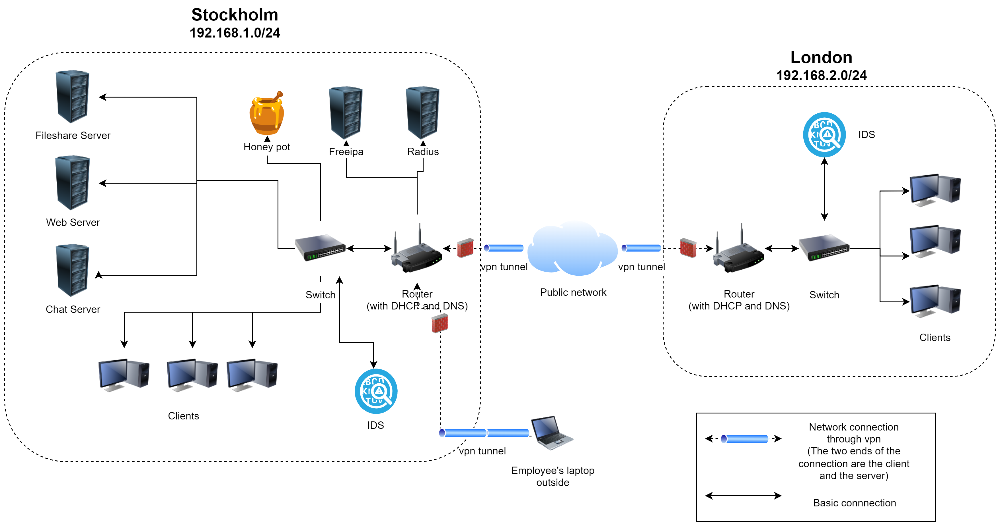

# Enterprise Network Security

Academic group project focused on designing, implementing, and testing a secure
multi-site enterprise network.

The environment consisted of two office networks connected through an encrypted
VPN tunnel, with centralized identity management, certificate-based authentication,
network security monitoring, and internal services.

## Architecture

The system consisted of two separate networks representing offices in Stockholm
and London. The sites were connected using OpenVPN, allowing users at either
location to securely access internal services across the network.

Both locations used OpenWrt-based routers providing core networking functionality
such as routing, DNS, DHCP, firewalling, and remote administration.

## Key Components

### Networking
- OpenWrt routers
- Routing between multiple network segments
- DNS and DHCP
- Firewall configuration
- Site-to-site and remote-access VPN using OpenVPN
- SSH-based administration

### Identity and Access Management
- FreeIPA for centralized identity and user management
- FreeIPA Certificate Authority for user and service certificates
- FreeRADIUS integrated with FreeIPA
- Certificate-based authentication using EAP-TLS
- Username/password authentication with one-time passwords (OTP)

### Security Monitoring
- Snort 3 for intrusion detection
- Splunk for log aggregation and visualization
- HFish honeypot for detecting and analyzing unauthorized access attempts
- Firewall rules for traffic filtering and attack mitigation

### Internal Services
- ownCloud for secure file sharing
- MongoDB backend
- Rocket.Chat for internal communication
- Linux-based servers and virtual machines

## Security Testing

The environment was tested using a simulated attack scenario.

The attack included:
- Network reconnaissance and port scanning
- SSH brute-force attempts
- Web directory enumeration
- Interaction with honeypot services

Snort alerts were forwarded to Splunk for monitoring, while HFish was used to
capture and analyze activity directed at decoy services.

## Technologies

`Linux` `OpenWrt` `OpenVPN` `FreeIPA` `FreeRADIUS` `LDAP` `Kerberos`
`PKI` `X.509` `EAP-TLS` `Snort` `Splunk` `HFish` `ownCloud`
`MongoDB` `SSH` `DNS` `DHCP`

## Project Context

This project was completed as part of the **Building Networked Systems Security**
course at KTH Royal Institute of Technology.

It was a group project where responsibilities were shared across the team.
All members participated in and were expected to understand the overall system
design, implementation, integration, testing, and documentation.

## Documentation

- [Final implementation report](docs/implementation-report.pdf)
- [Project presentation](docs/presentation.pdf)
